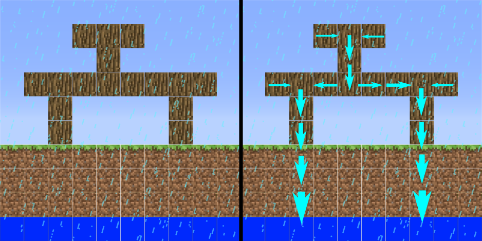

The architectural construction punishment by mechanical failure in voxel game
===


Usage
---
Generate testing map data:
```shell
cd '00 test map generator'
php run.php > chunk.txt
```

Compile the algorithm:
```shell
cd '../01 algorithm'
bash compile.bash
```

Prepare map data:
```shell
cp '../00 test map generator/chunk.txt' . 
```

Start computing:
```shell
./run
```

Visualize data:
```shell
cp data?.txt '../02 data visualize/.'
cd '../02 data visualize'
python3 run.py
```

